# openCX-T7G3 ESOF Teas Development Report

Welcome to the documentation pages of the Schedule IT of **openCX**!

- Business modeling
  - [Product Vision](#Product-Vision)
  - [Elevator Pitch](#Elevator-Pitch)
- Requirements
  - [Use Case Diagram](#Use-case-diagram)
  - [User stories](#User-stories)
  - [Domain model](#Domain-model)
- Architecture and Design
  - [Logical architecture](#Logical-architecture)
  - [Physical architecture](#Physical-architecture)
  - [Prototype](#Prototype)
- [Implementation](#Implementation)
- [Test](#Test)
- [Configuration and change management](#Configuration-and-change-management)
- [Project management](#Project-management)

So far, contributions are exclusively made by the initial team, but we hope to open them to the community, in all areas and topics: requirements, technologies, development, experimentation, testing, etc.

Please contact us!

Thank you!

Clara Moreira, Flávia Carvalhido, João Dossena, Leonor Gomes, Luís Assunção.

---

## Product Vision

Crafting YOUR personalized schedule, tailored for your needs.

---

## Elevator Pitch

Conference productivity? Let's make it a thing! You don't have to look for talks, we find them for you! With ScheduleIT, you’ll have your own personalized generated schedule fit to your preferences and interests! Going to a conference was never easier.

---

## Requirements
As a schedule application, the main requirements of our product
consist in generating a personalized and optimized schedule to each conference attendee based on their respective interests.
This schedule should then be displayed in a manner that is aesthetically appealing and intuitive to the user. 
The app must also allow the conference admin to enter the conference informations, such as the list of talks, the conference schedule and the respective tags.
As a mobile application the product needs to have a performance tailored to the capabilities of smartphones.


---

### Use case diagram

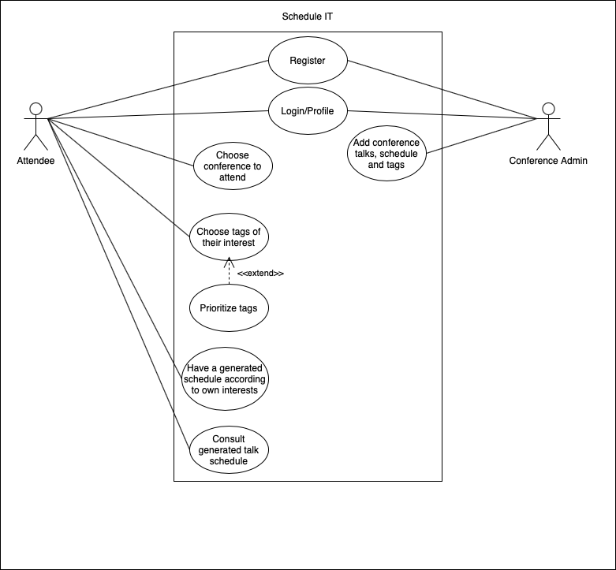

**Register**

- Actor: Attendee or Conference Admin
- Description: Attendees and Conference Admins register so that they can use the app and register in the system.
- Preconditions and Postconditions: Before the Register there is nothing, as a User's story begins registering so they can access their info later.
- Normal Flow: During register, user's provide their email, a password, name and location. After registering, user's usually carry on and make their own profiles and discover the app's functionalities.
- Alternative Flows: There are no alternate actions for the register process.

**Login/Profile**

- Actor: Attendee or Conference Admin
- Description: As of the act of registering, the users get access through login with email and password and have their own profile.
- Preconditions and Postconditions: To perform the login action, one must first register. Same goes for the profile.
- Normal Flow: During login, email and password should be provided and be valid credentials in order to access one's account. In the profile, people can visualize their own profile info.
- Alternate Flows: User's have to login to access the app, however they do not have to necessarily go through their profile everytime they login, they can skip ahead and do something else in the app.

**Choose tags of their interest**

- Actor: Attendee
- Description: Every attendee must have tags of themes in which they are interested in. Therefore, after register and also later on while using the app, attendees can choose (add or delete) tags. This is extremelly important for later generation of the schedule.
- Preconditions and postconditions: To choose tags, one must be logged in the app and have chosen the conference they will attend. After choosing the tags, the app has more information about the user's interests and will make a schedule tailored to them.
- Normal flow: After choosing the tags, the user will prioritize those tags in order for the app to take into consideration how much the user likes a theme compared to other.
- Alternate flow: Choosing tags is mandatory in order for the app to generate schedules therefore this is a mandatory step.

**Prioritize tags**

- Actor: Attendee
- Description: The attendees can order the tags they choose according to their preferences, after register and also later on while using the app.
- Preconditions and postconditions: Before prioritizing tags, the attendee must have selected the tags of his interest. After prioritizing tags,the app can generate a schedule even more tailored to the attendee.
- Normal Flow: The user should prioritize the tags after choosing them. After prioritizing the tags, the user can navigative the rest of the app.
- Alternate Flows: The users can prioritize tags whenever they want. Prioritizing tags is not a mandatory step, so the user can step over it.

**Choose conference to attend**

- Actor: Attendee
- Description: The attendee chooses the conference they want to attend so that the app can start generating a schedule for the attendee.
- Preconditions and postconditions: For the attendee to choose the conference, the conference must be already uploaded on to the app. 
After choosing the conference, the attendee can choose the tags according to their interests.
- Normal Flow: The attendee chooses from a list of available conferences the one he wishes to attend.
- Alternate Flows: The attendee must choose a conference for the app to generate a schedule. If he does not choose a conference, nothing happens and there's no generated schedule.


**Have a Generated Schedule According to Attendee interests**

- Actor: Attendee
- Description:The ateendes are presented with a costumized conference schedule, according to their interests.
- Preconditions and postconditions: There has to be a selected conference for the app to generate a schedule based on the attendee's interests. Afterwards, the attendee will have a personalized schedule just for them.
- Normal Flow: The attendee, after picking a conference, gets a automatically generated schedule based on their interests.
- Alternate Flows: There are no alternate flows to this use case.

**Consult Generated Talk Schedule**

- Actor: Attendee
- Description: The attendees are able to consult their generated talk schedule.
- Preconditions and postconditions: The attendee must be logged in and also have picked the conference he/she wants to participate in and the keywords he/she is interested in. After the schedule is generated, the attendee already has his/her own schedule to attend the conference and can consult it.
- Normal Flow: After choosing the conference and keywords of interest, the schedule is generated. The attendee will be able to open and consult it.
- Alternate Flows:After the schedule is generated, the attendee can check it whenever he/she wants.


**Add conference talks, schedule and tags**

- Actor: Conference Admin
- Description: The conference Admin can add the conference information, such as its talks, the schedule and tag, so that they can be accessed later on by the attendees.
- Preconditions and postconditions: The Conference Admins need to be logged in and have a talk schedule ready to add to the app.
- Normal Flow: The Conference Admin adds the talks to the app and proceedes to indicate the tags associated to them.
- Alternate Flows: This is a necessary step for the app to be able to generate schedules for the attendees.

---


### User stories

---

**Epic User Story** : As a conference attendee, I want to have a personalized schedule tailored to my interests.

---

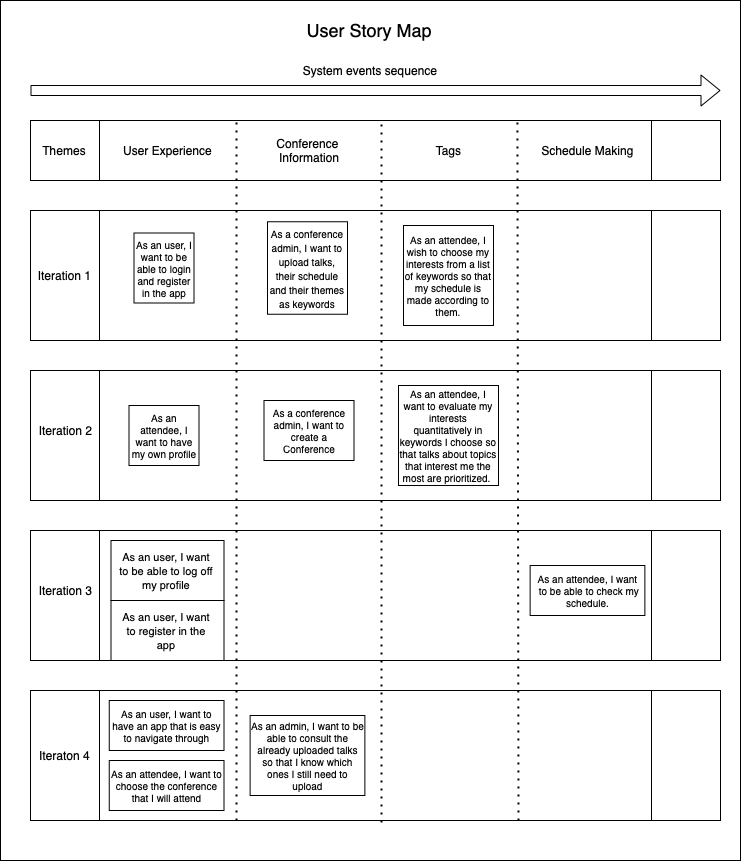

<br>

- As a conference admin, I want to upload talks, their schedule and their themes as keywords

**User interface mockups:**

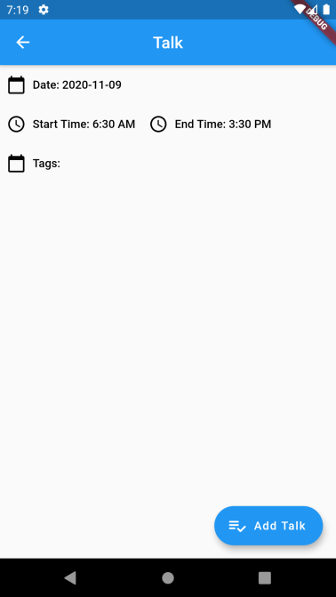

**Acceptance tests:**
```gherkin
	Scenario: Uploading talks as an admin
		Given I am logged in as an admin
		And I am on the add_talk page
		When I add a talk
		Then the talk is added on the app
```

**Value:** Must have

**Effort:** L

<br>

- As an user, I want to be able to login on the app

**User interface mockups:**

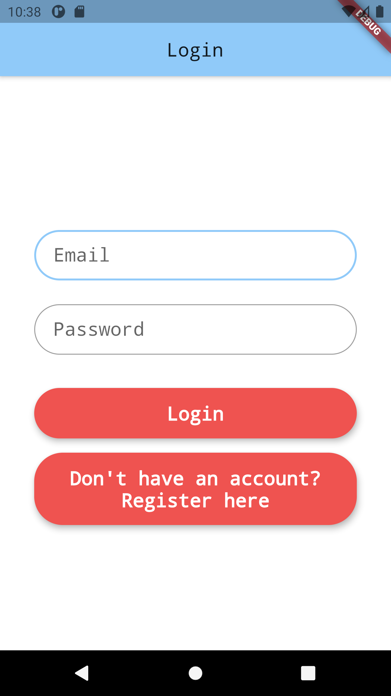


**Acceptance tests:**
```gherkin
	Scenario: Entering as an user
	    Given I am on the Login page
	    When I login with valid credentials
	    Then I am logged in
```

**Value:** Should Have

**Effort:** M

<br>

- As an attendee, I wish to choose my interests from a list of keywords so that my schedule is made according to them.

**User interface mockups:**

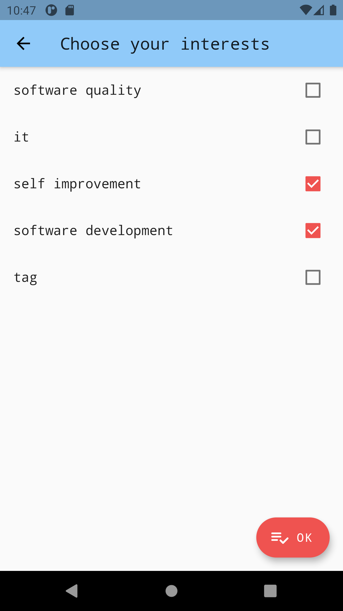

**Acceptance tests:**
```gherkin
	Scenario: Choosing interests as an attendee
		Given I am logged in as an attendee
		And I am on the choose tag page
		When I select a tag
		Then that tag is added as an interest of mine
```

**Value:** Must Have

**Effort:** M

<br>

- As an attendee, I want to have my own profile

**User interface mockups:**


**Acceptance tests:**
```gherkin
	Scenario: Consulting profile information
		Given I am logged in
		And I am viewing the Profile Page
		Then I see my profile information
```

**Value:** Must Have

**Effort:** L

<br>

- As an attendee, I want to evaluate my interests quantitatively in keywords I choose so that talks about topics that interest me the most are prioritized.

**User interface mockups:**

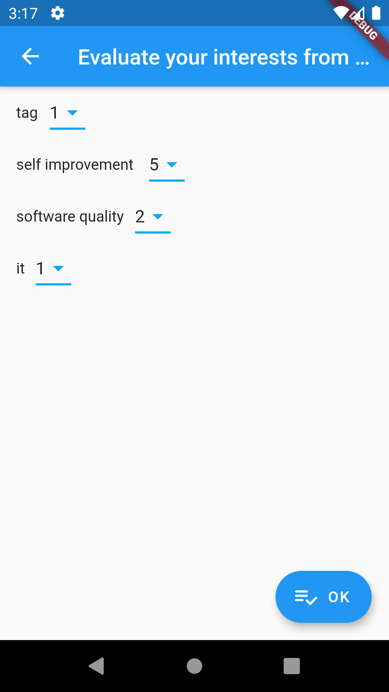

**Acceptance tests:**
```gherkin
	Scenario: Evaluating interests quantitatively
		Given I am logged in as an attendee
		And I am on the evaluate interests page
		When I choose the value of my interest
		Then that value persists on the app
```

**Value:** Should Have

**Effort:** M

<br>

- As an attendee, I want to choose the conference that I will attend.

**User interface mockups:**

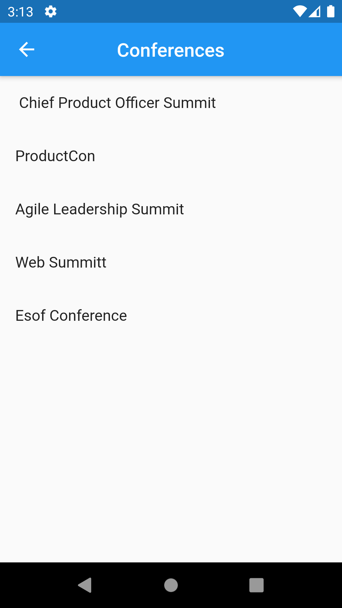

**Acceptance tests:**
```gherkin
	Scenario: Choosing a conference as an attendee
		Given I am logged in as an attendee
		And I am on the choose conference page
		When I select a conference
		Then I can select my interests
```

**Value:** Should Have

**Effort:** M

<br>

- As an attendee, I want to be able to check my generated schedule

**User interface mockups:**

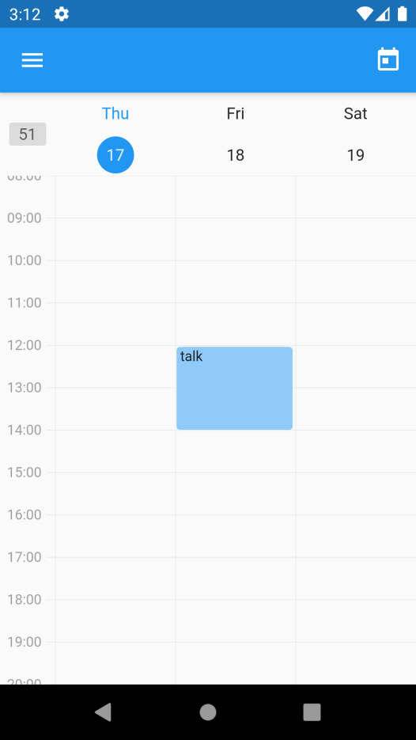

**Acceptance tests:**
```gherkin
	Scenario: Checking generated schedule
		Given I am logged in as an attendee
		And I have already chose my interests and evaluated them
		When I ask to see my schedule
		Then I can consult my schedule
```

**Value:** Could Have

**Effort:** L

<br>

- As an user, I want to be able to log out of my profile

**User interface mockups:**

**Acceptance tests:**
```gherkin
	Scenario: Logging out as an user
		Given I am logged in
		When I logout 
		Then I am logged out of the app
```

**Value:** Must Have

**Effort:** S

<br>

- As a conference admin, I want to create a Conference

**User interface mockups:**

**Acceptance tests:**
```gherkin
	Scenario: Creating a conference as an admin
		Given I am logged in as an admin
		And I am on the create_conference page
		When I create a conference with valid data 
		Then the conference is saved on the app
```

**Value:** Must Have

**Effort:** L

<br>

- As an user, I want to be able to register on the app

**User interface mockups:**

**Acceptance tests:**
```gherkin
	Scenario: Registering as a user
	    Given I am on the Register page
	    When I register with valid data
	    Then I am authenticated
```

**Value:** Should Have

**Effort:** S

<br>

 - As an user, I want to have an app that is easy to navigate through

 **User interface mockups:**

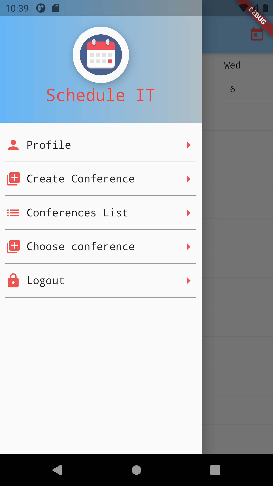


 **Acceptance tests:**
 ```gherkin
	Scenario: Navigating through the app
		Given I am logged in 
		When I open the burger menu
		Then I can navigate through the app
```

**Value:** Must Have

**Effort:** M


---

### Domain model

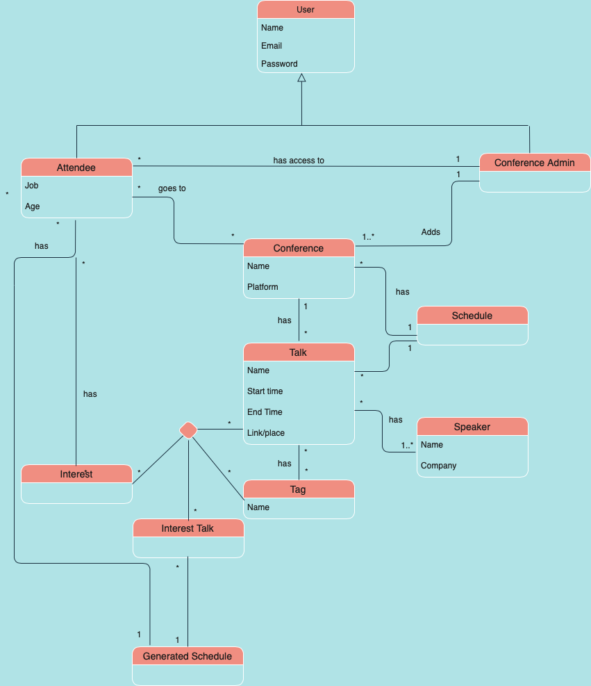

---

## Architecture and Design

The software architecture of the app contains all its key components and their relationships, from a logical and a physical point. All those key components and interactions between them are what makes the app.

---


### Logical architecture

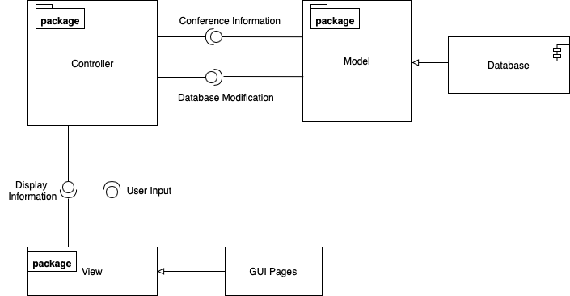

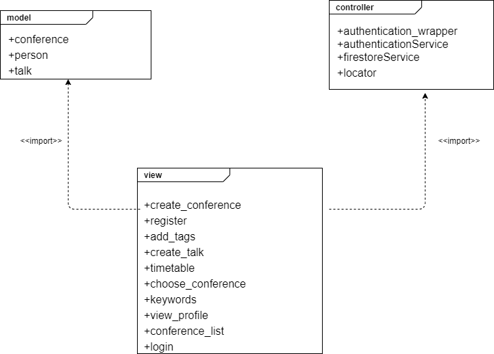

To structure our app on a high-level, we opted to use the MVC architectural pattern, since it is very recommended for this sort of project.

In the View component resides the user interface and front-end of our app: the display of our different app states and data.

The Model component contains all the app data: profiles, schedules, etc.

Last but not least, the Controller component that connects the Model to the View: the Model sends data for the View to display and the View sends user inputs for the Model to process.

The Model gets the data from the databases containing all the user and conference information and the View gets inputs from the user interactions with the GUI Pages.

### Physical architecture

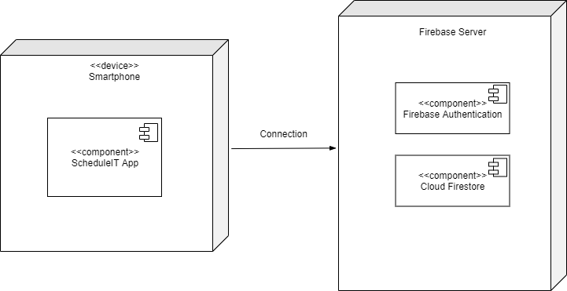

We are using the Flutter framework because it was recommended to us by our teachers as it is the easiest with which to get acquainted and to work. For authentication purposes in the app, we opted to use Firebase as it appears to be the best option for our login system. The server is needed to save our app data like schedules, talks, profiles, etc.

---

### Prototype

To help on validating all the architectural, design and technological decisions made, we usually implement a vertical prototype, a thin vertical slice of the system.

In this subsection please describe in more detail which, and how, user(s) story(ies) were implemented.

---

## Implementation

Regular product increments are a good practice of product management.

While not necessary, sometimes it might be useful to explain a few aspects of the code that have the greatest potential to confuse software engineers about how it works. Since the code should speak by itself, try to keep this section as short and simple as possible.

Use cross-links to the code repository and only embed real fragments of code when strictly needed, since they tend to become outdated very soon.

---

## Test

There are several ways of documenting testing activities, and quality assurance in general, being the most common: a strategy, a plan, test case specifications, and test checklists.

In this section it is only expected to include the following:

- test plan describing the list of features to be tested and the testing methods and tools;
- test case specifications to verify the functionalities, using unit tests and acceptance tests.

A good practice is to simplify this, avoiding repetitions, and automating the testing actions as much as possible.

---

## Configuration and change management

Configuration and change management are key activities to control change to, and maintain the integrity of, a project’s artifacts (code, models, documents).

For the purpose of ESOF, we will use a very simple approach, just to manage feature requests, bug fixes, and improvements, using GitHub issues and following the [GitHub flow](https://guides.github.com/introduction/flow/).

---

## Project management

We used [Github Projects](https://github.com/features/project-management/com) as our only project management tool to organize the project.

---

## Evolution - contributions to open-cx

Describe your contribution to open-cx (iteration 5), linking to the appropriate pull requests, issues, documentation.
